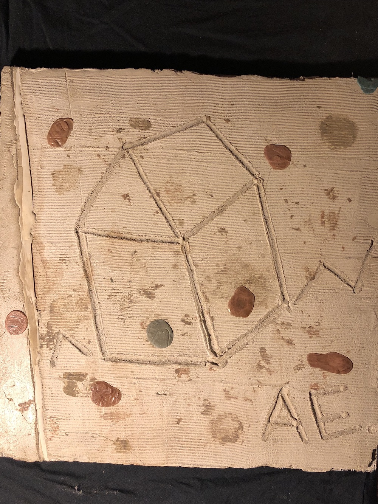

# PhotometricStereo

OpenCV scripts for generating normalMaps using photometric stereo technique

## Dependencies

* [OpenCV](https://medium.com/@jaskaranvirdi/setting-up-opencv-and-c-development-environment-in-xcode-b6027728003)
* [OpenCV(python bindings)](https://expressjs.com/)

## Uses

For a particular art peice choose 3 photos under different lighting conditions were the camera and subject do not more (are aligned)

Place them in a folder with a name of your choosing, and label the images (*_1.jpg, _2.jpg, _3.jpg*)

Steps should be done in the order as followed or based on your discretion

## Example


  
> 3 sources images
> subject and camera position are constant 
> light position varies and positions are unknown

  
> Peform affine adjustments and crop for straight images

  

 
> Generated Normal map along with albedo map ready to use


### Albedo
```
./albedo [foldername]/
```
> computes and albedo map for the subject by computing pixel averages across the 3 images

### Perspective Transform
```
python transform.py [foldername]/
```
> used to straigten the subject
> will openup window were you can click on 4 corners for transform
> click bottom left, top left, top right, bottom right
> hit [esc]

### Crop
```
python crop.py [foldername]/
```

> Crop to isolate subject
> opens up window to draw a rectangle, from top left to bottom right of subject
> hit [esc]

### Compute Normal
```
./normal [foldername]/ [threshold](int) [iterations](int)
```
> Computes normal map
> Threshold -> ignores sections were the grayscaled image value is below a certain intensity (used to discard shadows)
> Iterations -> number of iterations to run for simulated annealing, usually 200, but ranges can be from 500-7000

